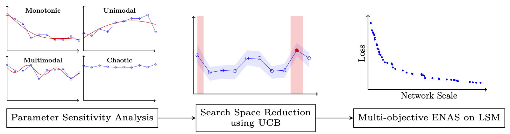
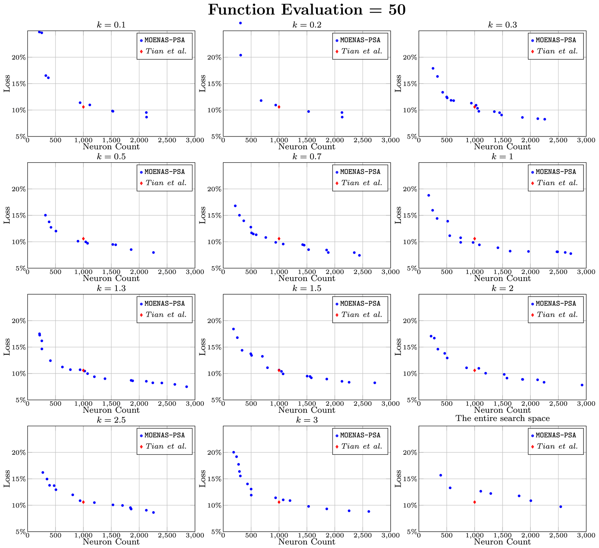

# MOENAS-PSA
> Multi-Objective Evolutionary Neural Architecture Search for Liquid State Machine

Sida Xin, Renzhi Chen, Xun Xiao, Yuan Li, Lei Wang

[[Supplementary]](doc/supplemental.pdf)
## Overview
<!--  -->

<br><br> 


This repository contains Python implementation of the algorithm based on multi-objective Evolutionary Neural Architecture Search and parameter sensitivity analysis (MOENAS-PSA).

The code in this repository performs MOENAS on a single-layer LSM model with three parallel reservoirs using the N-MNIST dataset. The search space is obtained with k=1 in the UCB algorithm.  
## Code Structure
.

├── input_spike_record -- N-MNIST dataset

├── LSM_MOENAS.sh -- run the experiment in bash

├── MOENAS_PSA_k_1 -- LSM simulation

├── MOENAS.py -- main execution file, RC means Reservoir computation

├── visualization.py -- result visualization

└── saved_state_100_16.pkl -- surrogate model
## Requirements
- Operating system: tested in Ubuntu 20.04
- Python 3.9.0
- Brian2 2.5.4
- pymoo 0.6.1.1
- TensorFlow 2.15.0

## Getting Started
Run the script file with bash, for example:
```
./LSM_MOENAS.sh
```
## Result
The ENAS results are saved in txt format, named `function_evaluation.txt`.

To see the Pareto front compared with the SOTA, run `visualization.py`.
## Citation
If you find our repository helpful to your research, please cite our paper:
```
@article{
}
```


